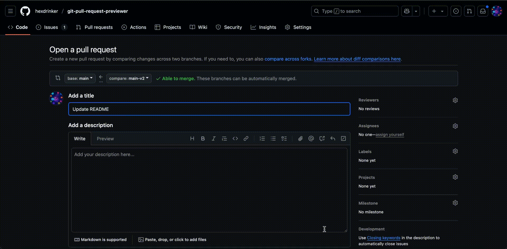
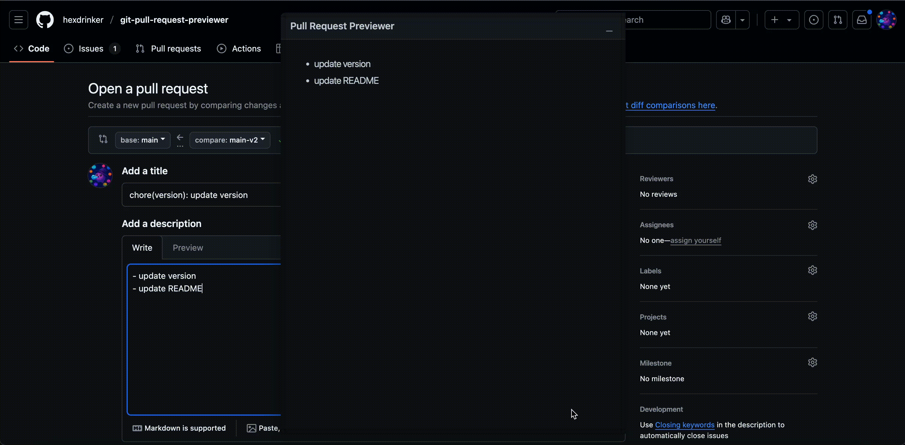

# PR Markdown Previewer

**Live Markdown Preview while writing GitHub Pull Requests**  
**GitHub PR 작성 중 마크다운을 실시간으로 미리 볼 수 있는 크롬 익스텐션입니다.**

---

## 📝 About

This Chrome extension shows a live preview of Markdown content as you write a pull request description on GitHub.  
GitHub에서 PR을 작성할 때, "Preview" 탭을 누르지 않아도 실시간 렌더링 결과를 확인할 수 있어요.

---

## ✨ Features / 주요 기능

- Live GitHub-flavored markdown rendering  
  GitHub 스타일 마크다운 실시간 렌더링

  

- Resizable and Movable Preview Panel
  사이즈를 조정할 수 있고 위치를 옮길 수 있는 프리뷰 패널

  

- Minimize / toggle visibility with one click  
  최소화 및 on/off 전환 버튼 제공

  

- Lightweight, fast, and no login required  
  빠르고 가벼우며 로그인 없이 사용 가능

---

## 🚧 Coming Soon / 추후 업데이트 예정

- Live preview for PR comments and review  
  PR 코멘트 영역에서도 미리보기 가능하도록 확장

---

## 🛠 Installation

### ▶ Chrome Web Store

[👉 Install from Chrome Web Store](https://chromewebstore.google.com/detail/pull-request-markdown-pre/kelpookbapppipgjcmilifllhcfdnmmb?authuser=1&hl=ko)

---

## 🙌 Contribution / 기여 안내

Still a rough project, and there's plenty of room to improve.  
완성도가 낮은 프로젝트로 개선의 여지가 많습니다.

This project is open source and welcomes contributions!  
이 프로젝트는 오픈소스로 누구든지 자유롭게 기여하거나 아이디어를 제안할 수 있어요 😊

- Issues or suggestions are welcome!
- Pull requests are appreciated.
- 피드백, 아이디어, 버그 리포트 모두 환영합니다.

Feel free to open an [issue](https://github.com/hexdrinker/git-pull-request-previewer/issues) or submit a pull request.  
언제든 PR이나 이슈로 남겨 주세요!

---

## 📄 License

MIT License  
[LICENSE](./LICENSE) 파일을 확인해 주세요.
